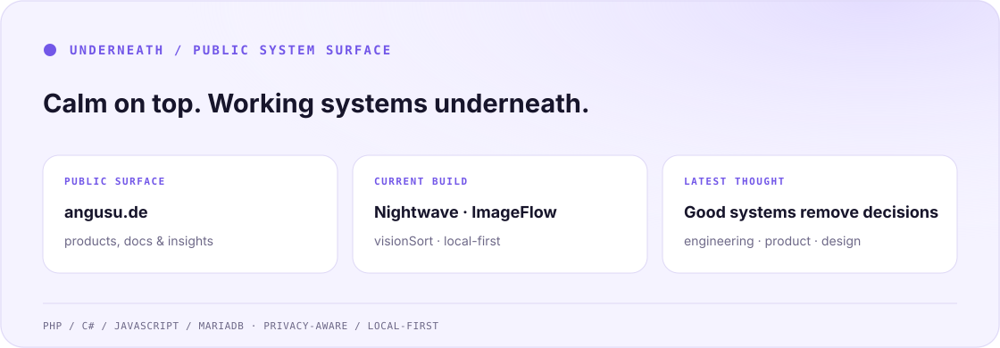

 

I build privacy-aware products, backend-heavy systems and calm interfaces that feel simpler than the work underneath them.

<a href="https://angusu.de/">
  <picture>
    <source media="(prefers-color-scheme: dark)" srcset="./assets/system-surface-dark.svg">
    <source media="(prefers-color-scheme: light)" srcset="./assets/system-surface-light.svg">
    
  </picture>
</a>

  <a href="https://angusu.de/">Public surface</a> ·
  <a href="https://angusu.de/docs/nightwave/">Nightwave</a> ·
  <a href="https://angusu.de/docs/imageflow/">ImageFlow</a> ·
  <a href="https://angusu.de/insights/good-systems-remove-decisions">Latest thought</a>

## Selected work

| | System | What it does |
|:--|:--|:--|
| `01` | **[WinTune](https://github.com/IamAngusU/WinTune)** | Local Windows diagnostics with explicit actions and signed updates. |
| `02` | **[Nightwave](https://angusu.de/docs/nightwave/)** | Theme switching designed to feel alive, not mechanical. |
| `03` | **[ImageFlow](https://angusu.de/docs/imageflow/)** | Adaptive image delivery for PHP sites without unnecessary infrastructure. |

## How I build

**Clear boundaries** over silent coupling · **local-first** where it matters · **privacy-aware** by default · **calm interfaces** over visual noise

`PHP` · `C#` · `JavaScript` · `MariaDB` · `MySQL` · `HTML/CSS` · `GitHub Actions`

## Thinking

- **[Good systems remove decisions](https://angusu.de/insights/good-systems-remove-decisions)** — complexity should be absorbed by the system, not handed to the user.
- **[AI does not replace understanding](https://angusu.de/insights/ai-does-not-replace-understanding)** — tools amplify judgment; they do not create it.
- **[Design should feel like home](https://angusu.de/insights/design-should-feel-like-home)** — familiarity and character can belong in the same interface.

  <a href="https://angusu.de/">Website</a> ·
  <a href="https://angusu.de/insights/">Insights</a> ·
  <a href="mailto:dev@angusby.dev">Email</a>

---

**Complex underneath. Calm on top.**
